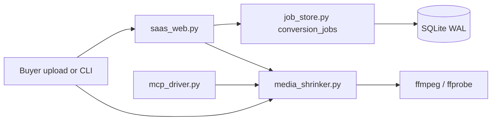
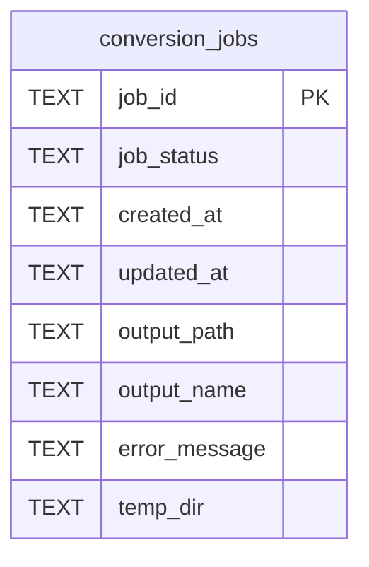

# Architecture

Codec Carver is four flat modules plus optional extras. Each module must
run alone. When another ContextualWisdomLab service vendors it as a
submodule, the same `convert_file` entry remains the contract.

## Core ERD

`conversion_jobs` is the durable async record. HTTP `/jobs` is a facade
over that table, not a second store. Column names are two-word
snake_case. See
[`docs/doctoring/conversion-jobs-schema.md`](docs/doctoring/conversion-jobs-schema.md).

## Current loop goal

1. Land the restored drop-zone click tree (#419) and its overlay (#428).
   Do not land #425 in parallel.
2. Land the Cloud Agent environment (#427) and the credential registry
   (#430). Do not land #426 or #429 in parallel.
3. This slice: `jobs` → `conversion_jobs` with a fail-closed legacy copy.
4. Next buyer gap after credentials: `usage_metering` stores
   `credential_id`; then durable result ownership and retention on
   `conversion_jobs`.
