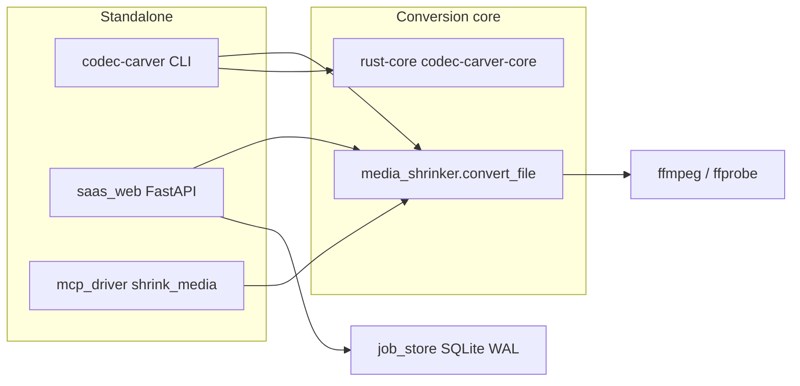
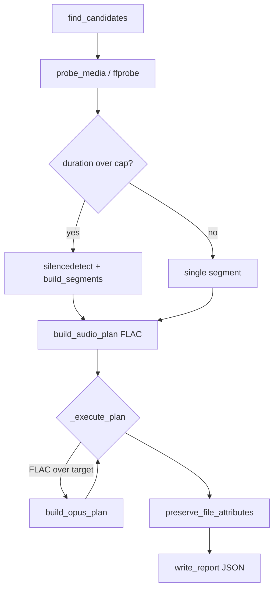
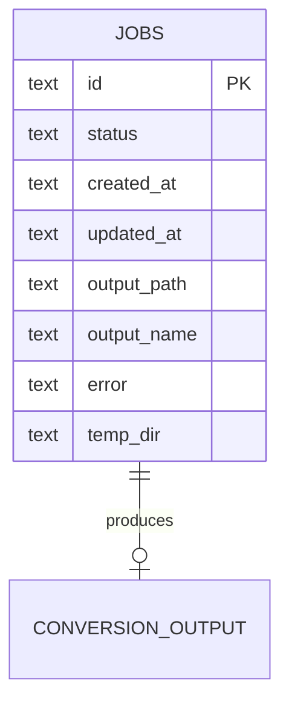

# Architecture

Codec Carver is the speech/video conversion module for STT and omni-modal LLM
input. It must run **standalone** (CLI, FastAPI upload service, MCP tool) and
as a **git submodule** consumed by naruon and sibling ContextualWisdomLab
services.

## Runtime surfaces

| Surface | Module | Buyer action |
| --- | --- | --- |
| CLI | `media_shrinker.py` | Carve a folder of recordings into size-capped FLAC/Opus. |
| Library CLI | `audio_library.py` → Rust | Inventory, hash, TMK, and GPU transcription batches. |
| Web | `saas_web.py` | Upload one file or a batch; poll `/jobs/{id}` for long work. |
| MCP | `mcp_driver.py` | Call `shrink_media` from an agent runtime. |
| Jobs | `job_store.py` | Survive process restart; do not keep results only in RAM. |

Sources are never overwritten. Generated names keep the original filename plus
a new suffix (`meeting.wav.flac`).

## Conversion pipeline

Silence splits prefer long quiet intervals; a hard split just under the
duration cap is the fallback. Parsers of ffmpeg/ffprobe text
(`parse_silencedetect_intervals`, `_parse_probe_payload`) treat that text as
untrusted input and raise `MediaShrinkerError` rather than unexpected types.

## Cloud Agent environment

`.cursor/environment.json` is the highest-precedence environment source for
Cloud Agents. Do not add `$schema` (the public schema rejects undeclared
fields).

| Phase | Script | Must do |
| --- | --- | --- |
| `install` | `.cursor/install.sh` | `cd` to repo root; hash-locked pip; fail-closed rustfmt; release-build Rust. |
| `start` | `.cursor/start.sh` | Rebuild Rust only if the binary is missing; start uvicorn; **wait on `GET /health`**. |
| ports | `8000` / `web` | Bind `0.0.0.0:8000` so the published port reaches the SaaS UI. |

Decision record: [`docs/doctoring/cloud-agent-environment.md`](docs/doctoring/cloud-agent-environment.md).

## Job-store data (current)

`job_store.py` persists async conversions. Table `jobs` is a single-word name
and is **known debt**: the org naming rule requires two-or-more-word
snake_case objects (`conversion_jobs`) plus a 3NF-preserving rename migration.
Do not add more single-word tables. Columns already use multi-word names where
they store paths (`output_path`, `output_name`, `temp_dir`).

Callers pass `now` explicitly. The store never calls `datetime.now()`.

## Security and operability baseline

- ffmpeg/ffprobe: `-nostdin` and `-protocol_whitelist file,crypto,data`.
- Uploaded names: sanitize to a safe basename; normalize Windows separators.
- Permissions copied onto outputs drop setuid/setgid/sticky bits.
- Opt-in API keys (`CODEC_CARVER_API_KEYS`) are a **known deviation**. Runtime
  reads must move to a SQLite/KV credential registry; env is bootstrap
  transport only (issues #329, #373).
- `GET /` and `GET /health` stay reachable without a key so a buyer can open
  the form and a probe can confirm liveness.
- PII in recordings is the product. Do not mask audio content; protect it with
  access control, retention, and encryption at rest instead.

## Ecosystem connectors (leverage order)

1. **naruon** — consume carved FLAC/Opus + JSON reports as speech/DOM input.
2. **contextual-orchestrator** — route transcription/LLM describe calls; do not
   read provider keys from raw env at runtime.
3. **wardnet** — place the SaaS UI behind the org WAF/APIM when exposed.
4. **keyverse** — replace shared API keys with passwordless service identity.
5. **clearfolio / newsdom-api** — attach transcripts and reports to documents.

Each connector must keep this repo independently runnable.

## Test and research baseline

- Unit/integration: `python3 -m unittest discover -s tests -v` (100% coverage
  over the configured sources; 100% interrogate on production modules).
- Reality checks: WAV → FLAC lossless; tiny `--target-bytes` → Opus; silence
  splits on long fixtures; Rust inventory SHA-256.
- Fuzz: Atheris harnesses in `fuzz/` plus Hypothesis mirrors in
  `tests/test_fuzz_properties.py`.
- Speech/codec changes attach APA 7th citations under `docs/doctoring/` and
  `docs/papers/` (PDF only when redistribution is permitted).
