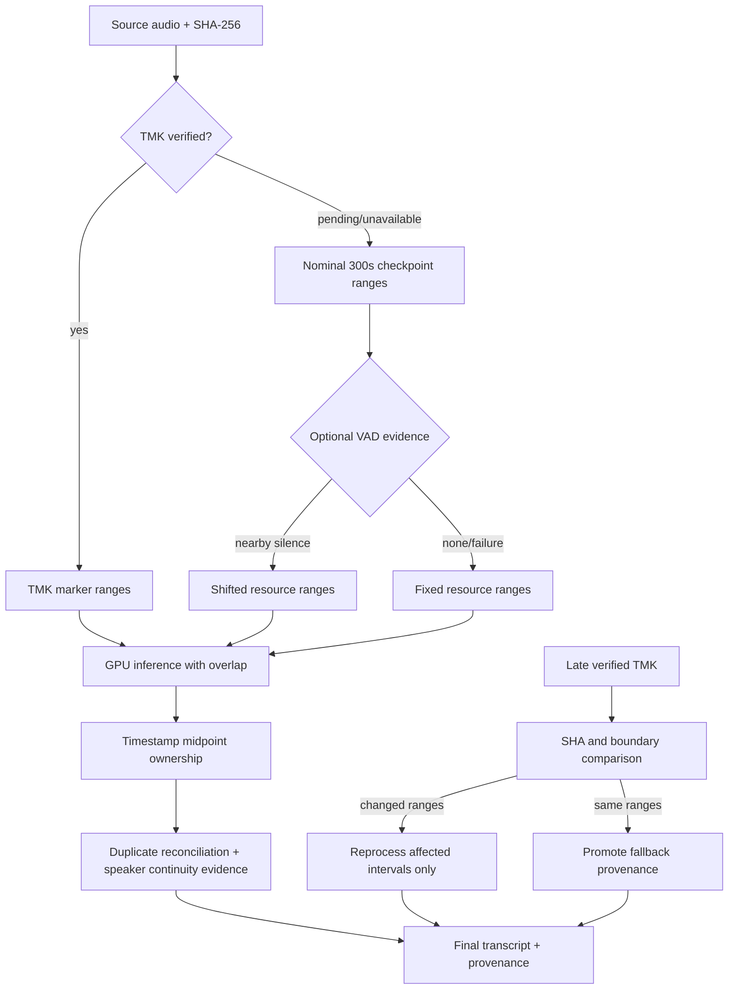

# Long-recording segmentation and late-TMK reconciliation (PRD/TRD/ADR)

Status: accepted for the GPU audio-library path.

## Product requirements

- The source SHA-256 is the identity for every transcript, partial, and
  checkpoint. A Sony TMK is evidence only after Rust has materialized, hashed,
  and parsed its bytes.
- Evidence precedence is **TMK markers**, then reliable chapter/marker
  metadata, then VAD/silence, then a bounded fixed-duration resource fallback.
  A pending iCloud sidecar is recorded as `tmk_pending_materialization`; a
  genuinely unavailable sidecar is `tmk_unavailable`.
- Five-minute cuts are checkpoint and memory limits, never semantic turns.
  Segment timestamps and speaker timestamps own the final transcript. Optional
  VAD may move a checkpoint within a configured search window and records the
  shift rather than silently replacing the nominal cut.
- The existing 2023-10-31 16:22 fallback is resumable and must not be thrown
  away when TMK arrives. The late-TMK reconciliation plan either promotes the
  fallback when the boundary vectors are equivalent or names only the affected
  intervals for GPU reprocessing.
- Ordered processing continues when iCloud cannot materialize one item; the
  blocked item remains in the queue with its error and status.

## Technical model

Each sidecar/checkpoint carries `segmentation_provenance` with independent
`source`, `tmk`, `vad`, `inference`, `checkpoint`, `final`, and `speaker`
objects. The flattened aliases (`source_sha256`, `tmk_status`,
`nominal_checkpoint_boundaries`, `inference_boundaries`, and
`final_boundaries`) are for simple consumers. A chunk also records nominal and
actual inference ranges, one-second overlap, ownership policy, and model/
accelerator identity. Segment reconciliation removes only equal-text,
timestamp-overlapping boundary duplicates; repeated speech separated in time is
retained.



## Rust/Python boundary

Rust remains responsible for no-follow discovery, SHA-256, TMK parsing,
materialization/staging, duplicate grouping, and rollback-safe mutations.
Python owns the pinned MLX/CUDA model, VAD policy, timestamp ownership,
speaker-aware text rendering, provenance, and reconciliation planning. Ollama
and CPU fallback are not part of this path.

## Measurement and acceptance tests

The benchmark report compares fixed and VAD-aware segmentation on the same
source and model: wall time, real-time factor, peak memory, duplicate/missing
boundary counts, timestamp and speaker continuity, text diff, and checkpoint
resume cost. The model-free helper records fixed-nominal and VAD-refinement
planner measurements separately and labels them as segmentation-planning-only;
it never presents those numbers as model inference speed. Tests cover
interruption, corrupted partials, stale source/TMK SHA, late TMK, dataless
placeholders, Unicode paths, duplicate boundary emissions, and rollback. A
VAD failure is a recorded evidence status and does not block fixed-range
recovery.

The deterministic baseline can be reproduced without loading a model:

```bash
python3 scripts/benchmark_segmentation.py \
  --duration-seconds 620 \
  --silence-json silence-intervals.json
```

The report labels model-dependent timestamp, speaker, and text comparisons as
requiring the same pinned GPU run; it does not present a segmentation-only
measurement as an inference speed claim.
