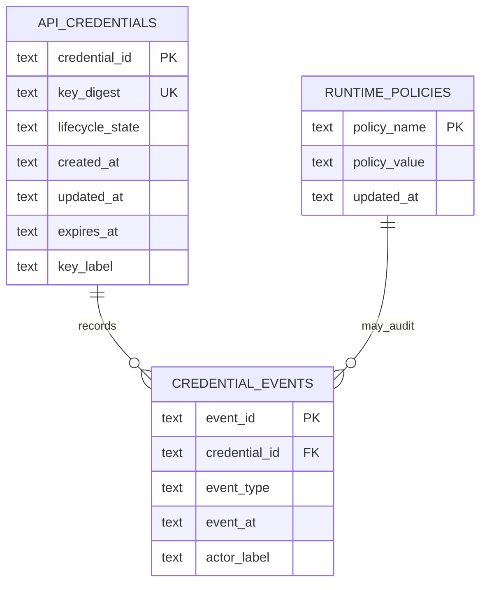

# API credential registry

## Decision

Codec Carver stores API-key verification material in a stdlib SQLite
registry (`credential_registry.py`). `CODEC_CARVER_API_KEYS` is bootstrap
transport only. Request handlers call `CredentialRegistry.verify_api_key`
and never read the process environment.

Operators should:

1. Put issued keys in `CODEC_CARVER_API_KEYS` (comma-separated) **or**
   call `import_plaintext_keys` against a durable `CODEC_CARVER_CREDENTIAL_DB`.
2. Start the SaaS process so `bootstrap_credentials_from_environ` copies
   those keys into `api_credentials` once.
3. Send `X-API-Key` on every upload, job, and download request. `GET /`
   stays open so a browser can load the form. A successful verify returns
   `credential_id` — store that on usage rows, never the plaintext key.
4. For a public bind (`0.0.0.0`), import keys first or the listen policy
   fails closed. Local empty-registry work requires explicit loopback
   development mode on `127.0.0.1`.
5. Rotate by inserting the next key, distributing it, then revoking the
   previous key. Rotated keys stay valid until revoke so in-flight
   clients are not dropped.

## Technical basis

OWASP API2 (Broken Authentication) requires rejecting unauthenticated
API access and avoiding ad hoc secret comparison on the request path
(OWASP Foundation, 2023). NIST SP 800-63B-4 treats shared secrets as
verifiers: store a non-reversible verifier, compare in a bounded way, and
support authenticator replacement without publishing the secret
(National Institute of Standards and Technology, 2025). HMAC comparison
of equal-length SHA-256 digests follows the keyed-hash compare contract
in RFC 2104 so a guess cannot short-circuit the remaining stored
verifiers (Krawczyk et al., 1997). Fail-closed production binds follow
NIST SSDF PW.1 / PW.5: do not accept network traffic against an empty
authenticator policy (Souppaya et al., 2022).

PII in recordings is the product. This registry authenticates callers; it
does not mask audio. Protect recordings with access control, retention
(#367), and encryption at rest instead of redacting speech.

Tables use two-or-more-word snake_case. `key_digest` is functionally
dependent on the issued key and replaces it (3NF). Events depend on
`event_id`. Policies depend on `policy_name`.

## Verification and rollback

- `tests/test_credential_registry.py` covers import, UTF-8 keys, hostile
  headers, constant-work compare, rotation, expiry, revoke, idempotent
  bootstrap, public-bind fail-closed, and concurrent verify during rotate.
- `TestApiKeyAuth` proves the request path ignores `CODEC_CARVER_API_KEYS`
  after bootstrap and never echoes secrets in 401 bodies.
- Roll back by restoring `get_configured_api_keys()` env reads only if
  the registry file is unreadable; do not return plaintext from list APIs.

## Next action

After this lands, wire `usage_metering` to `credential_id` instead of
storing plaintext in the single-word `usage` table, and close #329/#373.

## References

Krawczyk, H., Bellare, M., & Canetti, R. (1997). *HMAC: Keyed-hashing
for message authentication* (RFC 2104). Internet Engineering Task Force.
https://doi.org/10.17487/RFC2104

National Institute of Standards and Technology. (2025). *Digital identity
guidelines: Authentication and authenticator management* (NIST Special
Publication 800-63B-4). https://doi.org/10.6028/NIST.SP.800-63B-4

OWASP Foundation. (2023). *API2:2023 Broken authentication*.
https://owasp.org/API-Security/editions/2023/en/0xa2-broken-authentication/

Souppaya, M., Scarfone, K., & Dodson, D. (2022). *Secure Software
Development Framework (SSDF) Version 1.1: Recommendations for mitigating
the risk of software vulnerabilities* (NIST Special Publication 800-218).
National Institute of Standards and Technology.
https://doi.org/10.6028/NIST.SP.800-218
