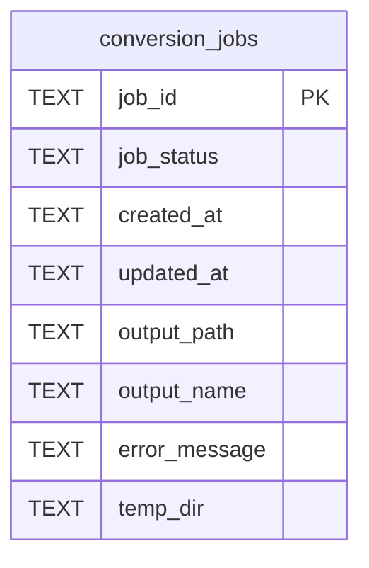

# Conversion jobs schema

## Decision

Async shrink work is stored in the SQLite table `conversion_jobs`. Every
column name is at least two words in snake_case. The public HTTP surface
keeps `/jobs` and `{job_id, status, error}` so existing poll clients do
not have to change.

A leftover one-word `jobs` table from earlier builds is copied into
`conversion_jobs` on open and then dropped. An unexpected legacy column
set fails closed instead of guessing a mapping.

`output_path` is the filesystem location the worker may serve.
`output_name` is the download name shown to the buyer. They are not the
same attribute: a ZIP of several carved parts can live at one path and
still download under a different name.

`created_at` and `updated_at` are the valid-time pair for the row.
Retention and credential ownership stay on later slices so this rename
does not collide with the credential-registry landing.

## Technical basis

Codd's third normal form requires non-key attributes to depend on the
whole key and nothing else. `job_id` is the only key. Status, timestamps,
paths, and the optional error message each describe that job. The
download name is not a deterministic function of the path, so keeping
both columns does not introduce a transitive dependency.

ISO/IEC 11179-1:2023 treats a data element's name as a semantic contract.
A single-word `jobs` / `id` / `status` / `error` table hid that this row
is a conversion job, not a generic queue entry. ISO 8601-1:2019
timestamps keep the temporal pair interchangeable across processes that
never call `datetime.now()` themselves.

## Verification and rollback

- `tests/test_job_store.py` requires the new column names on create,
  status transitions, and list/filter.
- A two-hour board-review meeting that finishes as
  `board-review.wav.flac` must still be `done` with that download name
  after the store is reopened.
- A pre-created `jobs` file with the historical eight columns must
  appear under `conversion_jobs` and the old table must be gone.
- A `jobs` table with any other column set must raise `ValueError`.
- Roll back by restoring the `jobs` DDL only together with the callers
  in `saas_web.py`. Do not keep mixed names.

## References

Codd, E. F. (1972). Further normalization of the data base relational
model. In R. Rustin (Ed.), *Data base systems* (pp. 33–64). Prentice-Hall.

International Organization for Standardization. (2019). *Information
technology — Metadata registries (MDR) — Part 1: Framework*
(ISO/IEC 11179-1:2023). https://www.iso.org/standard/78915.html

International Organization for Standardization. (2019). *Date and time
— Representations for information interchange — Part 1: Basic rules*
(ISO 8601-1:2019). https://www.iso.org/standard/70907.html
