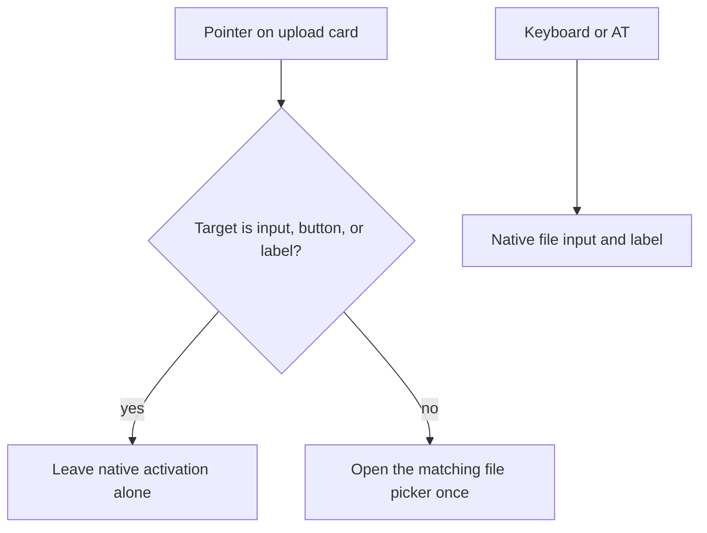

# Drop-zone pointer activation

## Decision

The single-file and batch upload cards are pointer-activation surfaces for the
matching native file control. Empty-space clicks open that picker once.
Clicks that originate inside `input`, `button`, or `label` descendants, including
a required-star `SPAN` nested in a `LABEL`, do not synthesize a second
activation. Keyboard and assistive-technology interaction stays on the native
control and its label.

`role="region"` plus a unique heading is an overlay on that tree. It is not a
substitute for the click listeners. Cards must not become `role="button"`.

Helper text names the next action: click the card or drag a file onto it.

## Technical basis

WCAG 2.2 Success Criterion 2.5.8 requires a minimum pointer target. Expanding
the card, rather than the native file control alone, gives a larger target
without inventing a second keyboard widget. WAI-ARIA 1.2 treats `role="region"`
as a perceivable landmark when it has an accessible name; that name comes from
the existing heading through `aria-labelledby`. Fitts' law predicts that a
larger, closer target reduces pointing time; the product claim here is the
executable click contract, not a measured pointing-time improvement.

Registration waits for `DOMContentLoaded` because the first script runs before
`#batch-drop-zone` exists. Inline `onchange` handlers remain reachable through
`window.updateFileSizePreview` and `window.updateBatchFilePreview`.

## Verification and rollback

- `tests/test_saas_ui_contract.py` executes the generated script in a Node DOM
  harness that models the parser boundary. Empty-space clicks must produce
  `{fileClicks: 1, batchClicks: 1}`. `INPUT`, `BUTTON`, `LABEL`, and a `SPAN`
  inside a `LABEL` must not increment those counts.
- Source contracts require `closest('input, button, label')`, the click-or-drag
  help strings, labelled regions, and named design tokens.
- `.jules/palette.md` must teach `closest(...)`. A `tagName`-only note is a
  regression because later design rewrites copy that file.
- Roll back by restoring the listeners, harness, and help strings together. Do
  not keep landmarks after deleting the click tree.

## References

Fitts, P. M. (1954). The information capacity of the human motor system in
controlling the amplitude of movement. *Journal of Experimental Psychology,
47*(6), 381–391. https://doi.org/10.1037/h0055392

World Wide Web Consortium. (2023, October 5). *Web Content Accessibility
Guidelines (WCAG) 2.2*. https://www.w3.org/TR/WCAG22/

World Wide Web Consortium. (2024, June 6). *Accessible Rich Internet
Applications (WAI-ARIA) 1.2*. https://www.w3.org/TR/wai-aria-1.2/
