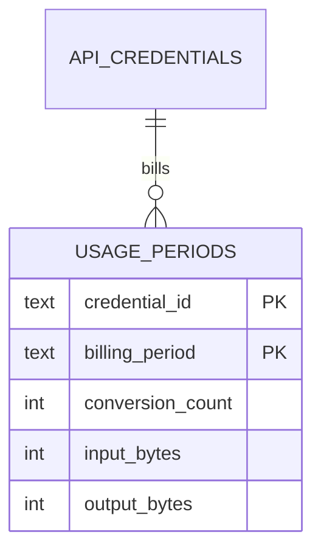

# Usage metering bound to credential identifiers

## Decision

Codec Carver bills conversions against `credential_id` in the two-word
`usage_periods` table. Request handlers call
`CredentialRegistry.verify_api_key`, stash the returned identifier on
`request.state`, then `check_quota` / `record` with that identifier.
Plaintext `X-API-Key` values are never written to usage rows, quota
errors, or billing exports.

Operators should:

1. Keep issued keys in the credential registry (see
   [`api-credential-registry.md`](api-credential-registry.md)).
2. Set `CODEC_CARVER_USAGE_DB` at process start so lifespan opens
   `usage_periods`. Optional `CODEC_CARVER_MAX_CONVERSIONS` and
   `CODEC_CARVER_MAX_BYTES` become monthly caps for every credential.
3. Send `X-API-Key` on `/shrink`, `/shrink-batch`, and `/jobs`. A 429
   with `Retry-After` means the current calendar month is spent; retry
   after the next billing period opens.
4. Export invoices with `UsageStore.all_usage("YYYY-MM")`. The map keys
   are credential ids. Match them to `list_public_records()` labels; do
   not look for the original secret.

## Technical basis

OWASP API4 (Unrestricted Resource Consumption) requires authenticated
API operations to enforce execution and payload limits so one caller
cannot exhaust shared transcode capacity (OWASP Foundation, 2023).
NIST SP 800-63B-4 treats the shared secret as a verifier: stores must
keep a non-reversible handle, not the authenticator itself, and
replacement must not republish the secret (National Institute of
Standards and Technology, 2025). Monthly `billing_period` buckets make
the time dimension explicit so January usage cannot leak into February
invoices. Fail-open local use (no registry, no usage database) stays
unmetered so a laptop CLI-adjacent session is not blocked.

PII in recordings is the product. Usage rows store sizes and counts,
not audio and not API keys. Protect recordings with access control and
retention (#367) instead of masking speech.

`conversion_count`, `input_bytes`, and `output_bytes` depend only on
`(credential_id, billing_period)` (3NF). The single-word `usage` table
that stored plaintext `api_key` is not created and is not migrated.

## Verification and rollback

- `tests/test_usage_metering.py` covers a 90-minute meeting upload,
  month rollover, concurrent workers, hostile identifiers, and the
  two-word schema.
- `TestApiKeyAuth.test_meeting_upload_quota_uses_credential_id_not_plaintext`
  proves `/shrink` records the registry id and returns 429 without
  echoing the key.
- Roll back by clearing `CODEC_CARVER_USAGE_DB` so metering stays off.
  Do not restore a plaintext `api_key` column.

## Next action

After this lands, attach `credential_id` to durable job rows
(`conversion_jobs`) so a restart can finish billing without the
original request, then close the usage half of #329/#373.

## References

National Institute of Standards and Technology. (2025). *Digital identity
guidelines: Authentication and authenticator management* (NIST Special
Publication 800-63B-4). https://doi.org/10.6028/NIST.SP.800-63B-4

OWASP Foundation. (2023). *API4:2023 Unrestricted resource consumption*.
https://owasp.org/API-Security/editions/2023/en/0xa4-unrestricted-resource-consumption/
