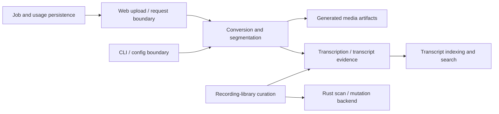

# Product / Technical Gap Baseline

Status: Proposed

Authority snapshot: `main@47c6fd27de13b0da37a7db64697b869941909351` (reviewed 2026-09-25).

This document is the repository-local gap ledger for Codec Carver. Code, protected-branch policy, current ADRs and exact-head pull-request evidence remain authoritative when they disagree with this snapshot. A PR is not considered integrated or released merely because it appears here.

## Product boundary

Codec Carver converts long recordings into size- and duration-bounded media artifacts while preserving source recordings and metadata. The repository also exposes an optional FastAPI upload surface, an MCP surface, searchable transcript/index functions, job/usage persistence, and a recording-library curation workflow whose byte-heavy scan/mutation work is delegated to the repository Rust backend. The protected README currently requires `ffmpeg` / `ffprobe` for the conversion path and keeps generated output separate from source recordings.

The code-current context map used for gap tracking is:

This is a context map, not a claim that every aggregate boundary has already been made explicit in code. Cross-context changes should preserve source-recording authority, request-scoped upload containment, generated-artifact separation, SHA/provenance evidence, and repository-owned persistence contracts.

## Current buyer-visible gaps

| Gap | Current evidence | Required acceptance / action |
| --- | --- | --- |
| Web initialization and preset state | PR #585 exact `f0d3b1cea3a7d4604361f20c43665587cf364a6e` has a deterministic RED proving the inline script executes before batch controls are parsed. The original preset-reset delta is otherwise valid. | Move the script initialization boundary after both forms (or equivalent without fail-open null handling), preserve global inline handlers and preset reset semantics, then prove single/batch preset → clear → reselect, submit, file/drop, error recovery, keyboard/focus and accessibility behavior in a real browser. |
| Overlapping target-byte validation UI | Several open branches implement pieces of maximum-value, required-field and accessibility validation; older candidates also contain the batch DOM-order repair. | Consolidate into one canonical successor rather than independently merging overlapping partial implementations. The successor must preserve server authority, distinguish empty/bad/range states, keep `setCustomValidity` and `aria-invalid` coherent, and pass responsive/keyboard/AT acceptance. |
| Transcript search performance | Canonical candidate #610 (`572f8e8b9aa8f73184f9ab73d92472730fdac7f3`) and alternate #622 evaluate in-place intersection and score-loop choices. One-shot and duplicate candidates are preserved behind those lanes rather than treated as proven optimizations. | First prove output/order/index-immutability equivalence for missing/repeated terms, skewed postings, early/late empty intersections and Unicode/CJK. Then ablate intersection vs score calculation on a right-cleared representative workload and record wall/CPU median+p95 plus allocation/peak memory. |
| Registry-safe public README links | PR #596 exact `305a797e336823518f3d4ae32b3d02962fcacddb` changes only two README links to reviewed commit-bound URLs. Current Semgrep, Security Scan and CodeQL PR runs are terminal success. | Obtain qualifying independent current-head approval before ordinary protected merge. Reusable enforcement remains owned by the central `.github` contract rather than copied here. |
| Product/public surface and commercial dependency boundary | PR #516 owns the product-first public surface and records the current FFmpeg/FFprobe commercial-boundary dependency; its own acceptance still names central review/publication and independent-review gates. | Keep licensing/commercial claims evidence-bound. Do not present the FFmpeg-backed path as commercially cleared until its owner dependency/replacement decision is integrated and released. |
| Release evidence | Open work is still distributed across Draft/Ready lanes and current protected `main` predates the above deltas. | Only release an exact protected descendant after version/CHANGELOG/package checks, terminal security and test gates, SBOM/provenance/reproducibility evidence, rollback instructions and immutable tag/release verification. |

## DDD and ownership constraints

The conversion/segmentation and recording-library curation responsibilities are product-domain truth and remain in this repository. Upload/request validation is an application boundary and must not redefine conversion invariants. Transcript search may optimize representation and evaluation but must not mutate the posting index while answering a query. Job/usage persistence owns its own database lifecycle; performance work there must preserve concurrency, WAL/recovery and transaction semantics rather than treating a microbenchmark as sufficient evidence.

Reusable CI/review/security/release mechanics belong to the central `.github` owner. LLM-backed functionality, if introduced, must consume a released contextual-orchestrator contract rather than embedding provider/model ownership here. No mutable sibling-head source copy is an accepted dependency boundary.

## Execution order

1. Repair #585's deterministic DOM-order RED and obtain exact-head browser/accessibility evidence.
2. Collapse overlapping upload-validation candidates into a verified successor that inherits every valid validation/accessibility delta; preserve predecessors until that inheritance is demonstrated.
3. Add semantic equivalence and representative measurement to #610/#622, select the measured search implementation, and only then retire superseded performance candidates.
4. Move #596 through independent review and ordinary protected integration if the unchanged exact head remains green.
5. Advance #516 and its commercial dependency prerequisite without weakening the stated FFmpeg/FFprobe boundary.
6. After protected integration, refresh this baseline from the new protected head before any release claim.

## Release and operability gate

A release-ready head must be a descendant of the then-current protected branch and must have terminal required tests/security checks, zero valid unresolved review findings, qualifying review, package/version/CHANGELOG coherence, immutable release metadata, SBOM/provenance evidence, reproducibility evidence and an executable rollback path. Queued, predecessor-head, author-only, synthetic or status-manufactured evidence does not transfer.
